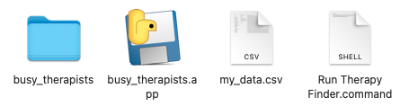
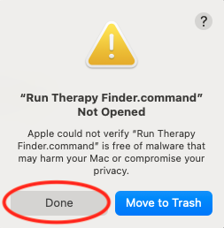
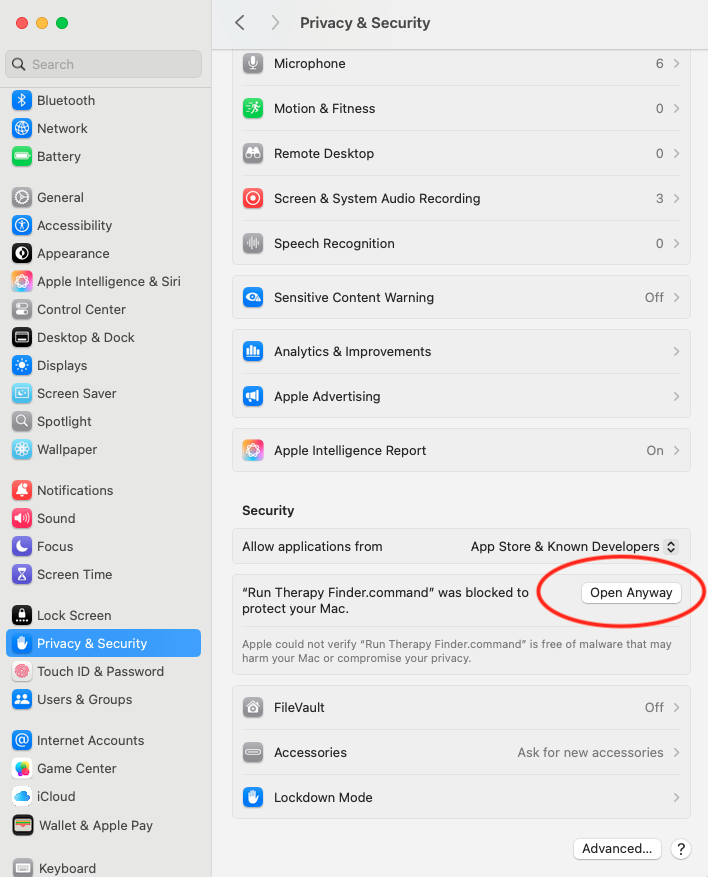
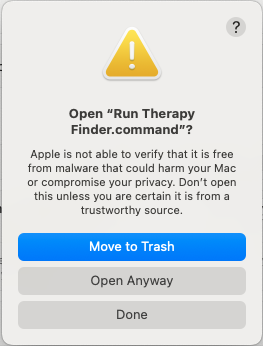
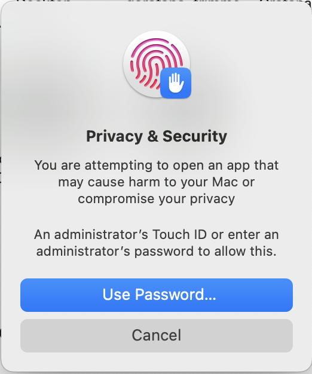
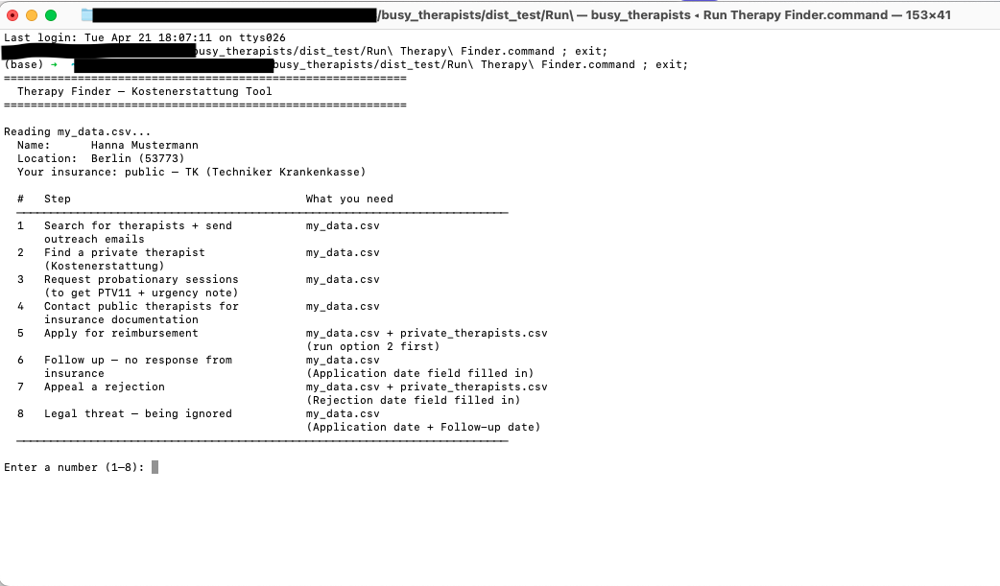

# Getting Started (No coding required)

> You don't need to install Python or use a terminal. Just download the app, fill in one file, and double-click to run.
>
> **Available for macOS (Apple Silicon and Intel) and Windows.**

---

## Step 1: Download the app

1. Go to the [latest release on GitHub](https://github.com/sasanamari/busy_therapists/releases/latest)
2. Download the zip for your machine:
   - **Mac with M1/M2/M3/M4 chip:** `TherapyFinder_macOS_arm64.zip`
   - **Mac with Intel chip:** `TherapyFinder_macOS_intel.zip`
   - **Windows:** `TherapyFinder_Windows.zip`
3. Double-click the zip file to unzip it — a folder called `busy_therapists` will appear
4. Move that folder somewhere convenient, like your Desktop or Documents

---

## Step 2: Set up your data file

The tool reads your personal details from a file called `my_data.csv`. A template is included in the download.

1. Open the `busy_therapists` folder — you should see a `my_data.csv.example` file alongside the app and launcher. (The screenshot below shows macOS — Windows looks similar but without the `.app` and `.command` files.)

   

2. Make a copy of `my_data.csv.example` and rename the copy to `my_data.csv`
   - **Mac:** right-click → Duplicate, then rename it
   - **Windows:** right-click → Copy, then right-click → Paste, then rename it
   - The file must be named exactly `my_data.csv` — the tool won't find it otherwise

3. Open your `my_data.csv`:
   - **Mac (easiest):** double-click — it opens in Numbers. Numbers saves it automatically in its own format and the tool will still find it. No CSV export needed.
   - **Mac / Windows — Excel:** right-click → Open With → Excel. If the file opens with all the content squashed into column A, go to **Data → Text to Columns**, choose **Delimited**, click Next, tick **Comma** as the delimiter, and click Finish. The columns should split correctly.
   - **Google Sheets (recommended if you don't have Excel or Numbers):** go to [sheets.new](https://sheets.new) in your browser — this opens a blank spreadsheet. Then go to **File → Import**, upload `my_data.csv`, and choose **Comma** as the separator. Google Sheets is free and works in any browser with no installation. If you've never used it before, [this short intro](https://support.google.com/docs/answer/6000292) covers the basics.

4. Fill in the **Your data** column. The **Notes** column explains each field. You don't need to fill everything in right away — come back and update it as you progress through the process.
   - For a full explanation of every field, see the [my_data.csv reference](my_data_reference.md).
5. Save the file.

> `my_data.csv` stays on your computer — it is never uploaded anywhere.

---

## Step 3: Run the tool

- **Mac:** double-click `Run Therapy Finder.command`
- **Windows:** double-click `Run Therapy Finder.bat`

### Security warnings (first run only)

Downloaded apps that aren't from an official store may trigger a security warning the first time you run them. This is normal — here's how to handle it on each platform.

<strong>macOS — if the app is blocked (click to expand)</strong>

macOS may block the launcher the first time. If it does:

**1.** You'll see this warning — click **Done** (not "Move to Trash"):

**2.** Open **System Settings** → **Privacy & Security**. Scroll down to the Security section and click **Open Anyway**:

**3.** A second confirmation will appear — click **Open Anyway** again:

**4.** Confirm with Touch ID or your Mac login password:

**You only need to do this once.** After the first approval it launches directly.

<strong>Windows — if SmartScreen blocks the app (click to expand)</strong>

Windows may show a "Windows protected your PC" warning the first time. If it does, click **More info** → **Run anyway**. You only need to do this once.

---

## Step 4: Use the tool

A terminal window opens and the tool loads your data, then shows a numbered menu:

Type a number and press Enter to run that option. Read the [step-by-step guide](guide.md) to understand which option to use and when.

When the tool finishes, the terminal window stays open. You can close it — on Mac with **Cmd+W**, on Windows just close the window normally.

---

## Output files

After the first run, a folder called `output/` will appear next to the app. The tool manages this automatically — you don't need to touch it to follow the guide.

**If you want to start fresh:** delete the relevant file from `output/` before running the tool again. The next run will create a new one. (For example, if you ran option 4 with the wrong filters, delete `output/busy_therapists.csv` and run again.)

For reference, here's what each file is:

| File | What it is |
|---|---|
| `busy_therapists.csv` | Therapists contacted for general outreach (options 1 & 4) |
| `probationary_therapists.csv` | Therapists contacted for probationary sessions (option 3) |
| `private_therapists.csv` | Private therapists contacted for Kostenerstattung (option 2) |
| `contact_log.pdf` | Formatted PDF of your contact log, generated when you run option 5 — attach this to your insurance application |
| `emails.html` | Your generated emails — open in a browser to send |
| `therapists.txt` | Human-readable list of therapists found in the most recent scraper run |

Each CSV **appends** new results on every run — useful if you're building up your contact list over multiple sessions.
